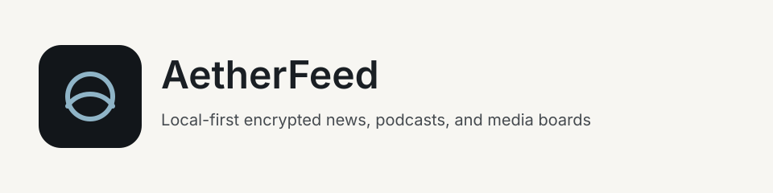

<!-- GENERATED by scripts/generate-project-readme.py — edit branding/product.json -->

  

<h1 align="center">AetherFeed</h1>

<strong>Local-first encrypted news, podcast, and booru client</strong>

  
  
  
  
  
  

  
  
  

## Pitch

AetherFeed is a quiet, local-first reader. Subscribe to RSS, Atom, and JSON feeds, listen to podcasts, and browse public media boards. Everything stays on your device in an encrypted vault. Optional zero-knowledge sync uploads only opaque blobs — never plaintext stars, tags, or settings.

## Demo

  

> Add screenshots or a short demo GIF under `docs/images/` and link them here when available.

## Features

- News reader with offline articles, reader mode, stars, tags, and OPML import/export
- Podcast client with queue, downloads, speed, chapters, and lockscreen controls
- Booru tag search with local favorites, saved queries, and blacklists
- SQLCipher vault plus OS keystore for credentials and sync key material
- Optional E2E sync over Google Drive AppData or WebDAV — passphrase never leaves the device
- No analytics, crash reporters, ads, or tracking libraries

## Quick start

1. Clone the repo and install Android SDK (JDK 17+) plus Rust/Node for the Windows desktop app.
2. Open your coding agent and follow `docs/START_HERE.md`. First-time walk: `docs/help/TOUR.md` (Cursor: `/tour`).
3. Android: `cd examples/android && ./gradlew test`. Desktop: `cd examples/desktop && npm install && npm run tauri dev`.

## For humans

Start with this README, then [`CONTRIBUTING.md`](../../CONTRIBUTING.md) and [`docs/BEST_PRACTICES.md`](../../docs/BEST_PRACTICES.md). The first-month playbook is [`docs/FIRST_30_DAYS.md`](../../docs/FIRST_30_DAYS.md).

## For agents

Read [`docs/START_HERE.md`](../../docs/START_HERE.md) and [`AGENTS.md`](../../AGENTS.md). In Cursor type `/tour` or `/bootstrap`. Any other IDE: ask the agent to read [`docs/help/TOUR.md`](../../docs/help/TOUR.md). `/coach` is the next recommended action.

## Install

Android: build a debug APK from `examples/android` or install a GitHub Release. Windows: download the Tauri installer from GitHub Releases, or run the desktop example locally. No account is required.

## Usage

Add feeds on first launch. The local vault works immediately. Sync is optional and lives under Settings. If you forget the sync passphrase, the encrypted backup cannot be recovered.

## Configuration

Copy [`.env.example`](../../.env.example) to `.env` for local secrets (never commit `.env`). Stack-specific config lives in the active `examples/` or app root after prune.

## Contributing

See [`../../CONTRIBUTING.md`](../../CONTRIBUTING.md). Prefer small PRs; follow Conventional Commits and the BUILD_PLAN labels (`AGENT` / `HUMAN` / `ADB` / `AUTO`). Status markers: 🔲 open · ✅ done · ❌ blocked.

## Security

See [`../../SECURITY.md`](../../SECURITY.md). Enable Dependabot alerts and follow [`docs/SECURITY_TRIAGE.md`](../../docs/SECURITY_TRIAGE.md) for weekly CVE triage.

## License

[MIT License](../../LICENSE) — see the license file for terms.

## Acknowledgments

Scaffolded with [agent-project-bootstrap](https://github.com/edwardlthompson/agent-project-bootstrap). Brand assets: [`../BRANDING.md`](../BRANDING.md). Design system: [`../../docs/DESIGN_GUIDE.md`](../../docs/DESIGN_GUIDE.md).
