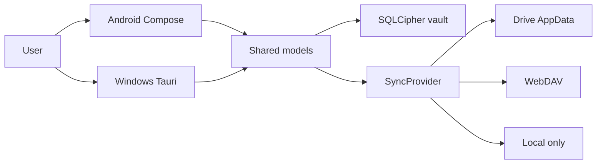

# Product Specification

> Status markers: 🔲 open · ✅ done · ❌ blocked.

## Overview

**Product:** AetherFeed  
**Purpose:** Local-first encrypted client for news (RSS/Atom/JSON), podcasts, and public media boards.  
**Users:** People who want a Google Reader-style workflow without giving a host plaintext state.

## Functional Requirements & User Stories

| ID | Story | Acceptance |
|----|-------|------------|
| FR-1 | As a reader I subscribe to feeds and read them offline | Articles and images live in the vault |
| FR-2 | As a listener I play podcasts with a queue and position | Position survives process death |
| FR-3 | As a browser I search public boards by tag | Favorites and blacklists stay local |
| FR-4 | As a multi-device user I optionally sync ciphertext | Provider never sees plaintext |
| FR-5 | As a privacy-first user I never create an account | First-run vault works immediately |

## Non-Functional Constraints

- MIT license; no AGPL vendored without a HUMAN decision
- No analytics, crash reporters, ads, or tracking
- File budgets: 300 lines static data, 150 lines pure logic
- FOSS Android: no Play Services / Firebase
- Drive scope limited to `drive.appdata`

## Architecture & Data Flow

## Test-first rule

Every feature in `docs/plan.md` / BUILD_PLAN must list tests, or state why
automation is not feasible and name the fallback command.
